# ПЗ-13: Дослідження кольорових гармоній та інструментів аналізу кольору в Adobe Color

## Мета заняття

- Ознайомитися з поняттям кольорової гармонії та її значенням у дизайні.
- Вивчити типи гармоній: Analogous, Monochromatic, Triad, Complementary, Split Complementary, Square, Custom.
- Навчитися працювати з колірним колесом та інструментами Adobe Color.
- Перевірити контрастність кольорів відповідно до стандартів WCAG.
- Закріпити навички оформлення результатів у Markdown-форматі.

---

## Теоретична частина

**Кольорова гармонія** — це поєднання кольорів, яке виглядає естетично привабливо та викликає позитивне емоційне сприйняття. Гармонійна палітра забезпечує баланс, зрозумілу візуальну структуру та полегшує сприйняття дизайну.

### Типи кольорової гармонії:

- **Analogous** — кольори, розташовані поруч на колірному колесі; створюють м’яке, гармонійне враження.
- **Monochromatic** — відтінки одного кольору; підходять для мінімалістичних дизайнів.
- **Triad** — три рівновіддалені кольори; забезпечують контраст і гармонію водночас.
- **Complementary** — протилежні кольори на колірному колесі; надають сильного контрасту.
- **Split Complementary** — два кольори, сусідні до комплементарного; м’якший контраст.
- **Square** — чотири кольори, рівномірно розташовані на колі; яскраві та збалансовані.
- **Custom** — індивідуально підібрані поєднання відповідно до стилю або бренду.

---

## Колірні моделі

- **RGB**: використовується для екранів, складається з червоного, зеленого та синього.
- **HSB**: описує колір через тон (Hue), насиченість (Saturation) та яскравість (Brightness).
- **LAB**: модель, що ближче до людського сприйняття; використовується для точного аналізу кольору.

---

## Перевірка доступності через контрастність

**Контрастне співвідношення** — це співвідношення яскравості тексту до фону. Визначає, наскільки добре читається текст.

### Стандарти WCAG 2.1:

- **AA**: мінімальний рівень контрасту — 4.5:1 для звичайного тексту, 3:1 для великого.
- **AAA**: підвищений рівень — 7:1 для звичайного тексту, 4.5:1 для великого.

---

## Практична частина

### 1. Колірне колесо

---

#### SC2 – Analogous (Аналогічна)
- **Базовий колір**: Синій  
- **Ефект**: Спокійний, гармонійний, підходить для фонів або UI з м’яким настроєм.

#### Виконане завдання

  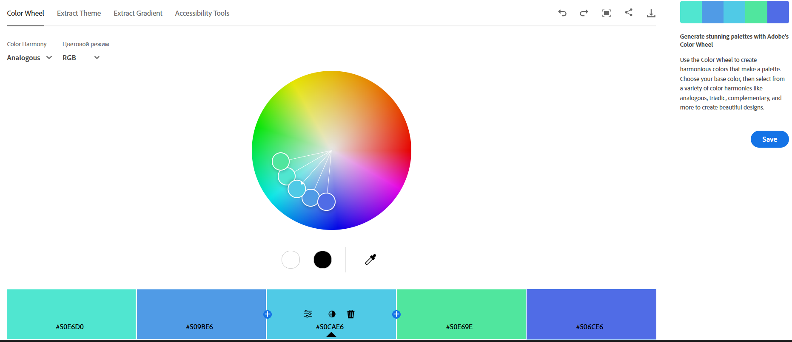

---

#### SC3 – Monochromatic (Монохромна)
- **Базовий колір**: Блакитний 
- **Ефект**: Чистота стилю, відчуття єдності, підходить для акцентів та контрасту.

#### Виконане завдання

  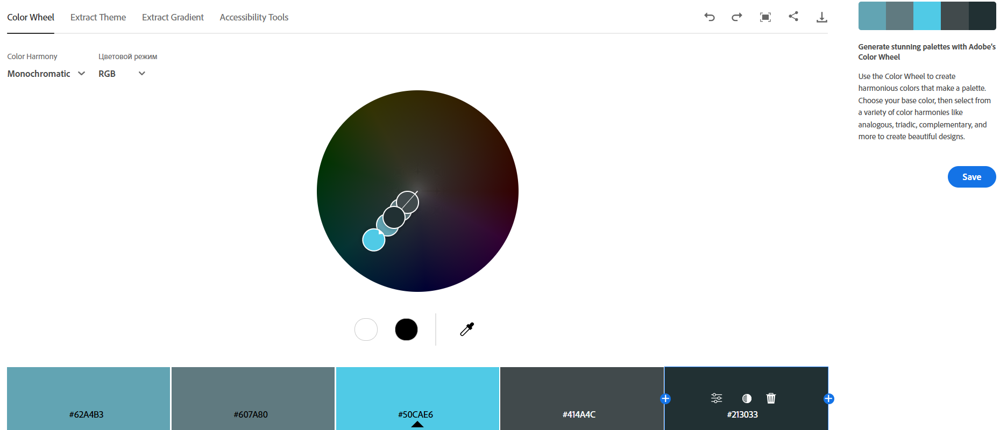

---

#### SC4 – Triad (Тріада)
- **Базовий колір**: Блакитний 
- **Ефект**: Жвавий, динамічний, добре підходить для дитячих або ігрових додатків.

#### Виконане завдання

  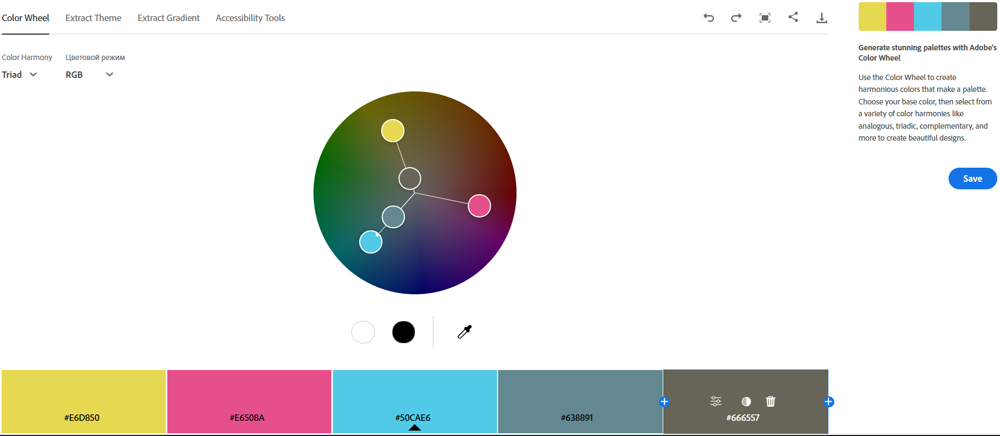

---

#### SC5 – Complementary (Комплементарна)
- **Базовий колір**: Блакитний 
- **Ефект**: Контрастний, яскравий — привертає увагу.

#### Виконане завдання

  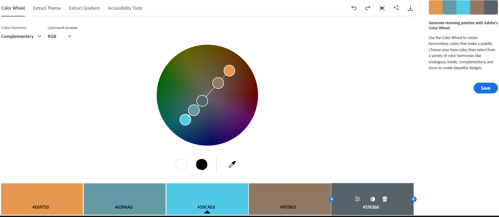

---

#### SC6 – Split Complementary (Розділена комплементарна)
- **Базовий колір**: Блакитний  
- **Ефект**: Більш збалансований контраст.

#### Виконане завдання

  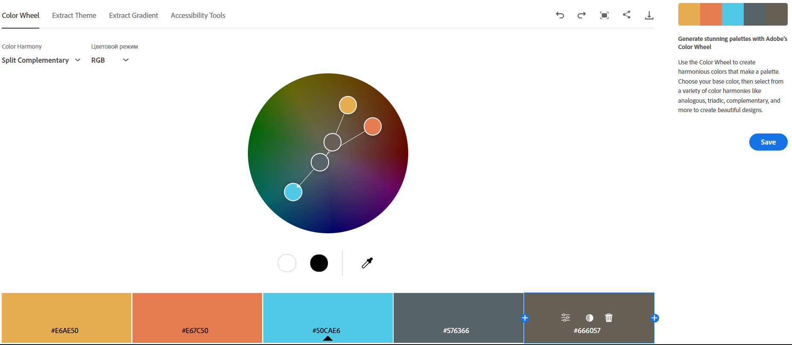

---

#### SC7 – Square (Квадратна)
- **Базовий колір**: Синій  
- **Ефект**: Яскравий, живий — для креативних рішень.

#### Виконане завдання

  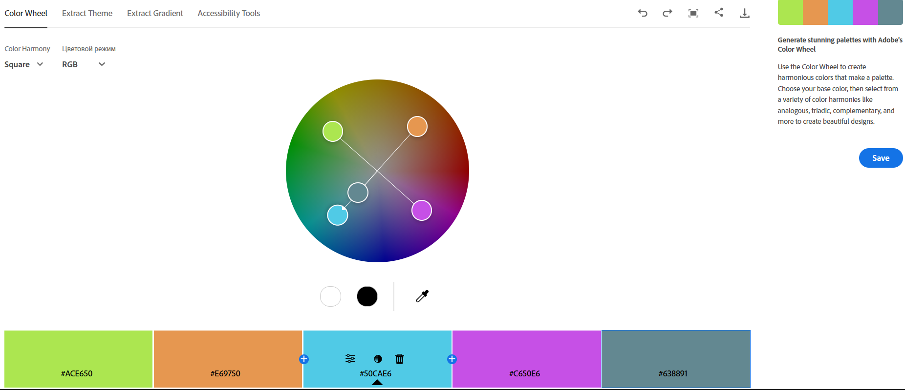

---

#### SC8 – Compound (Складена)
- **Базовий колір**: Синій 
- **Ефект**: Менш контрастна, ніж комплементарна, дає м’якіший вигляд при збереженні кольорової напруги.

#### Виконане завдання

  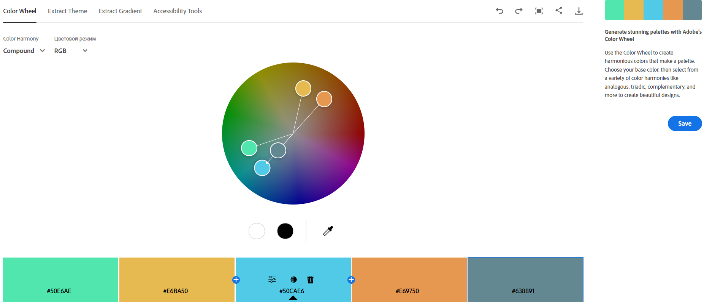

---

#### SC9 – Shades (Відтінки)
- **Базовий колір**: Синій  
- **Ефект**: Глибина, строгість, підходить для професійного дизайну.

#### Виконане завдання

  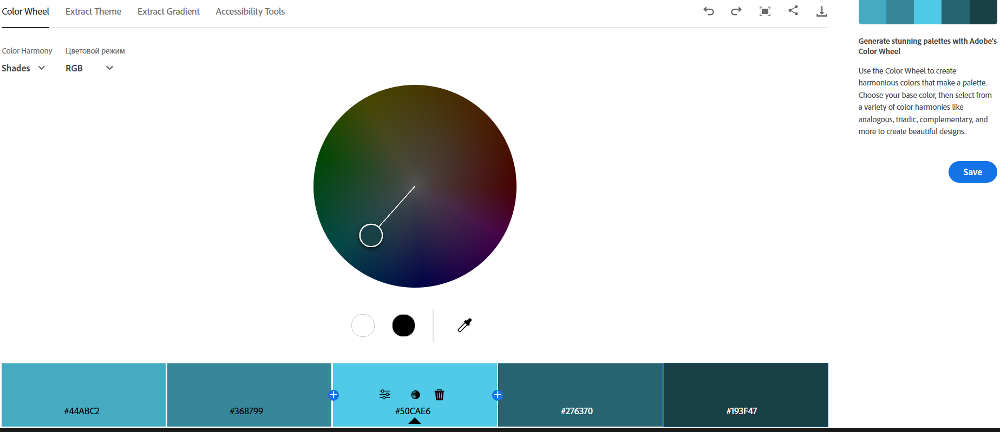

---

#### SC1 – Custom (Користувацька)
- **Базовий колір**: свытло синій 
- **Ефект**: Індивідуальний стиль, контрастний, сучасний вигляд.

#### Виконане завдання

  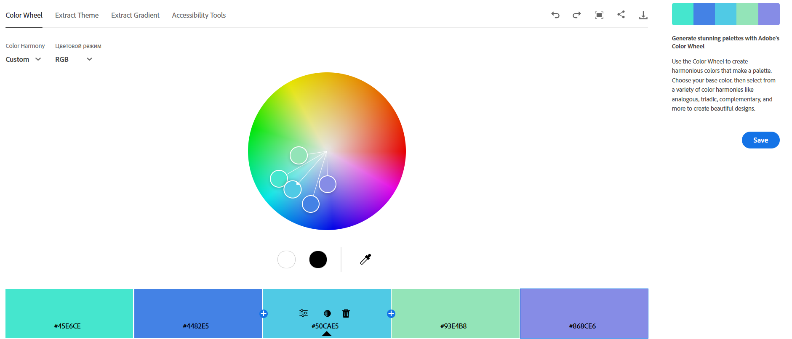

### 2. Extract Theme

#### SC10 – Colorful
- **Ефект**: Емоційний, живий, підходить для розважальних додатків.

  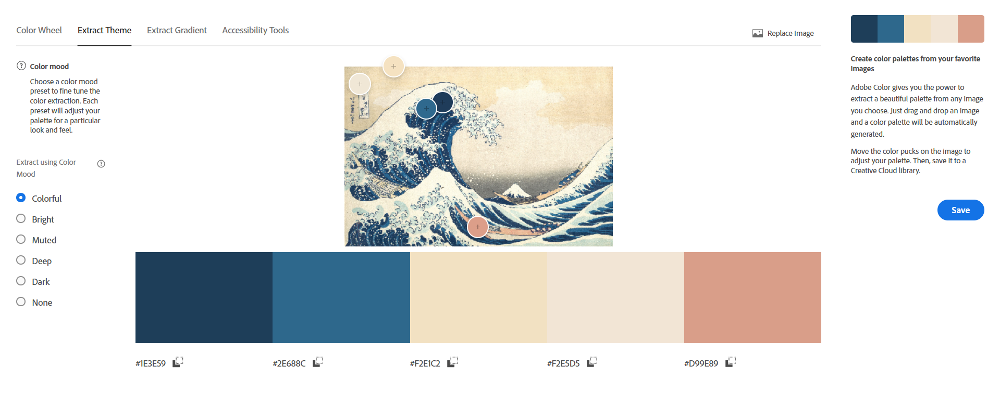

#### SC11 – Muted
- **Ефект**: Стриманий, професійний, підходить для корпоративних інтерфейсів.

  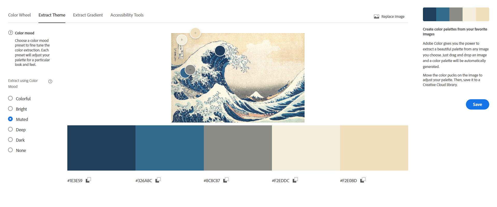

- **Найбільш придатна палітра для інтерфейсу додатку**: *Muted*, оскільки краще забезпечує зручність читання і менше стомлює очі.

---

### 3. Extract Gradient

#### SC12 – Побудований градієнт
- **Опис**: Три точки створюють плавний перехід кольорів із зображення — ідеально для фону або кнопок.

  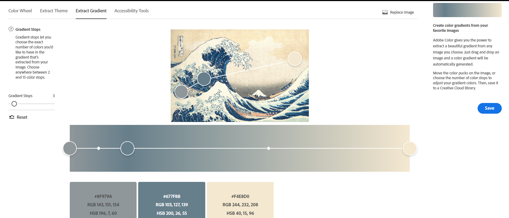

### 4. Accessibility Tools

#### SC13 – Коригування контрасту
- **Рівень контрасту**: 8.97:1

  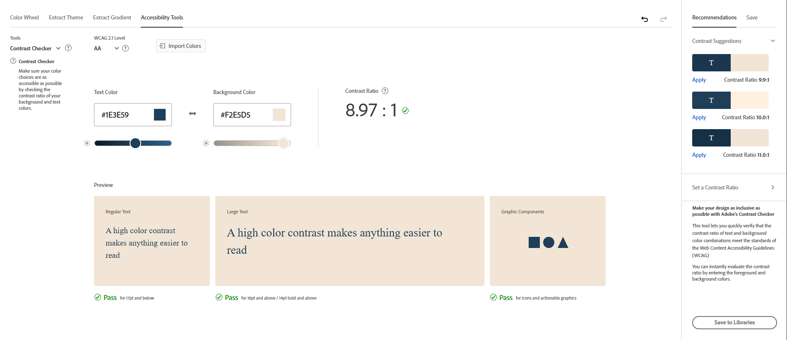

- **Результат**: Проходить рівень AA для звичайного та AA для великого тексту.
- **Контрастна пара кольорів**: Темно-синій текст на світло бужовому фоні — чудова читабельність.

---

## Висновки

- Найбільш зручними для UI є палітри типу **Analogous**, **Monochromatic** і **Split Complementary** — вони забезпечують візуальну єдність і комфорт для очей.
- Модель **HSB** зручна для швидкого підбору тону і насиченості.
- Контрастність є критично важливою для доступності — особливо при створенні текстових інтерфейсів.
- Інструменти Adobe Color дають змогу легко експериментувати з гармоніями та перевіряти їх придатність для дизайну.

---

> Скріншоти розміщено в папці `images/` з назвами `SC1.png` до `SC13.png`.
